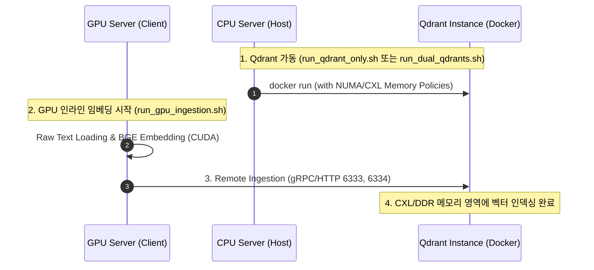

# 🚀 CXL VectorDB Build & Run Pipeline (BGE-base-en-v1.5)

이 리포지토리는 CXL(Compute Express Link) 및 NUMA(Non-Uniform Memory Access) 아키텍처 환경에서 **Qdrant VectorDB의 성능 벤치마크 및 리소스 격리 시뮬레이션**을 수행하기 위해 최적화된 독립형 파이프라인 리포지토리입니다.

기존 사전 임베딩 방식의 물리적 오버헤드를 극복하고, **GPU 서버에서 실시간 임베딩 후 CPU 서버의 Qdrant 인스턴스로 초고속 원격 삽입(Ingest)**을 수행하는 다이렉트 파이프라인 아키텍처를 제공합니다.

---

## 🗺️ 아키텍처 및 시스템 흐름 (System Workflow)

본 파이프라인은 CPU 서버(VectorDB 구동)와 GPU 서버(실시간 임베딩 연산) 간의 원격 고속 통신을 활용하여 동작합니다.



---

## 📂 디렉토리 구조 (Directory Structure)

불필요한 구형 Docker 이미지 빌드 파일들을 걷어내고, 호스트 직접 가동 및 통신 구조로 가볍고 깨끗하게 정리되었습니다.

```text
cxl_vectordb/
├── run_qdrant_only.sh           # 🖥️ [CPU 서버] 단일 Qdrant VectorDB 컨테이너 가동 (NUMA 바인딩 지원)
├── run_dual_qdrants.sh          # ⚡ [CPU 서버] 듀얼 소켓 격리형 Multi-Instance Qdrant 가동 (CXL/DDR 메모리 튜닝)
├── qdrant_numactl_docker_guide.md # 🐳 Docker 컨테이너 수준의 커널 NUMA 바인딩 기술 가이드
├── gpu_side/                    # 🚀 [GPU 서버] 실시간 임베딩 및 데이터 업로드 파트
│   ├── run_gpu_ingestion.sh     # GPU inline 임베딩 및 원격 Qdrant 삽입 실행 쉘
│   ├── build_vectorDB.py        # Qdrant 연결, 컬렉션 검증 및 고속 삽입 파이썬 스크립트
│   └── download_huggingface.py  # 원본 데이터셋 및 임베딩 모델 로컬 다운로더
├── Data/                        # 📂 [로컬 전용] Qdrant DB 스토리지 볼륨 영역 (.gitignore에 지정되어 Git 비대상)
└── README.md                    # 본 문서
```

---

## 📥 사전 준비: 데이터셋 및 모델 다운로드 (Prerequisites)

GPU 서버에서 원격 Ingestion을 구동하기 위해 필요한 **파이썬 패키지 환경**과 **대용량 데이터셋**, **임베딩 모델**을 다운로드하고 준비합니다.

### 0. GPU 서버 파이썬 패키지 환경 구성 (Environment Setup)
먼저 GPU 서버에서 스크립트 실행 및 라이브러리 가동을 위한 필수 패키지들을 설치합니다. `gpu_side/requirements.txt`를 통해 간편하게 일괄 설치가 가능합니다.

```bash
cd gpu_side

# 필수 AI 및 Qdrant 라이브러리 일괄 설치
pip install -r requirements.txt
```

### 1. C4 데이터셋 다운로드 (약 61GB)
원본 데이터셋(`Shahzebbb/c4_100gb`)을 GPU 서버의 로컬 디렉토리에 저장합니다. `download_huggingface.py` 스크립트를 통해 안전하게 다운로드할 수 있습니다.

```bash
# 데이터셋 다운로드 및 로컬 디렉토리 저장
python3 download_huggingface.py \
    --hf-dir "Shahzebbb/c4_100gb" \
    --save-dir "/home/<username>/cxl_vectordb/Data/c4_100gb"
```

### 2. BGE 임베딩 모델 준비
* **자동 다운로드**: `run_gpu_ingestion.sh`를 실행할 때, HuggingFace 허브로부터 **`BAAI/bge-base-en-v1.5`** 모델과 토크나이저가 로컬 캐시 경로(`/home/<username>/.cache/huggingface`)로 자동 캐싱됩니다.
* **오프라인 사전 준비 (선택사항)**: 네트워크 속도가 느리거나 수동으로 미리 캐싱하고 싶은 경우, 아래 명령어를 실행하여 로컬 디렉토리에 직접 다운로드해 둘 수 있습니다.
```bash
python3 download_huggingface.py \
    --embedding-model "BAAI/bge-base-en-v1.5" \
    --save-dir "/home/<username>/.cache/huggingface"
```

---

## 🏃‍♂️ 실행 가이드 (Execution Guide)

### 1️⃣ CPU 서버: Qdrant VectorDB 가동
CPU 서버(호스트)에서 데이터가 저장될 VectorDB 컨테이너를 가동합니다.

#### 💡 단일 인스턴스 기동 시 (일반 테스트)
```bash
# 기본 모드 기동 (호스트 전체 자원 사용)
bash run_qdrant_only.sh

# NUMA 최적화 모드 기동 (DDR Node 0 + CXL Node 2 바인딩)
bash run_qdrant_only.sh --numa
```

#### ⚡ 듀얼 소켓 독립 인스턴스 기동 시 (대칭/비대칭 성능 평가)
각 소켓(Socket 0, Socket 1)에 개별 Qdrant 인스턴스를 띄우고 메모리 정책(Policy)을 개별 부여합니다.
```bash
# weighted interleave (DDR/CXL 가중치 배분) 정책으로 듀얼 기동
bash run_dual_qdrants.sh --policy weighted

# 다른 가용한 메모리 정책 옵션:
# --policy ddr-only      : 각 소켓의 로컬 DDR 메모리만 사용
# --policy cxl-only      : 각 소켓의 CXL 확장 메모리만 사용
# --policy interleave    : DDR과 CXL 메모리에 페이지를 1:1 교차 할당
```

---

### 2️⃣ GPU 서버: 실시간 원격 데이터 삽입 (Remote Ingestion)
GPU 자원이 탑재된 임베딩 서버에서 원본 데이터셋(`c4_100gb`)을 GPU로 실시간 BGE 임베딩하면서 CPU 서버의 Qdrant로 다이렉트 전송합니다.

```bash
cd gpu_side

# 1. GPU 서버로 원격 VectorDB 대상 IP 및 포트를 인자로 주며 기동
# Usage: ./run_gpu_ingestion.sh [QDRANT_HOST_IP] [QDRANT_PORT]
./run_gpu_ingestion.sh <CPU_SERVER_IP> 6333
```
* **동작 메커니즘**: `run_gpu_ingestion.sh` 내에서 `build_vectorDB.py`가 가동되며, PyTorch/CUDA 가속을 통해 대량의 문서 배치(Batch Size: 512)를 초고속 임베딩하고 CPU 서버로 gRPC API를 통해 주입합니다.

---

### 🔄 3️⃣ 데이터 복제 및 듀얼 소켓 평가 (Replication)
단일 서버 빌드가 완전히 완료되면, CPU 서버에서 해당 Qdrant 스토리지 폴더를 복제하여 `qdrant_storage_socket0`와 `qdrant_storage_socket1`로 나눈 뒤 `run_dual_qdrants.sh`를 사용해 서로 다른 NUMA 메모리 정책 하에서 Qdrant 벤치마크 평가를 동일한 데이터 기반으로 즉시 수행할 수 있습니다.

---

## 🏆 핵심 최적화 장점 요약
1. **네트워크 병목 최소화**: GPU에서 연산 완료된 벡터 임베딩 값을 gRPC 채널로 전송하여 원격 주입 속도를 극대화했습니다.
2. **도커 이식성**: 복잡한 환경 설정 없이 공식 `qdrant/qdrant:latest` 이미지를 활용하면서 커널 레벨의 `numactl` 바인딩을 주입합니다.
3. **완벽한 메모리 제어**: DDR-only, CXL-only, Weighted Interleave 등 최신 CXL 하드웨어 성능 검증을 위한 시나리오 정책을 즉각적으로 테스트할 수 있습니다.
