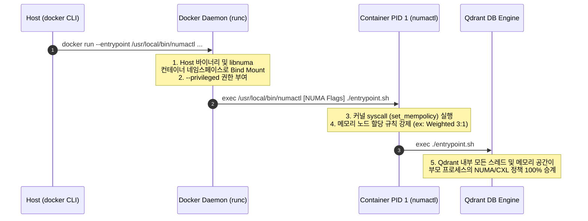

# 🐳 Docker Container Direct NUMA Pinning Guide (using numactl Entrypoint)

이 문서는 Docker 컨테이너 실행 시 호스트의 **`numactl` 바이너리 및 라이브러리(libnuma)를 OCI(Open Container Initiative) 계층에 바인드 마운트**하여, 컨테이너 내부에 별도 빌드 없이 **커널 수준의 NUMA/CXL 메모리 정책(Interleave, Weighted Interleave 등)을 직접 주입**하는 고급 아키텍처 가이드입니다.

---

## 🗺️ 시스템 동작 메커니즘 (Under the Hood)

일반적인 호스트 프로세스 실행과 달리 Docker 컨테이너는 컨테이너 실행 클라이언트가 아닌 **Docker 데몬(dockerd/containerd)**에 의해 기동됩니다. 따라서 호스트의 단순 `numactl docker run` 명령어는 컨테이너에 전달되지 않습니다.

본 솔루션은 컨테이너 구동 진입점 자체를 `numactl`로 대체하여 NUMA 정책을 온전히 승계하도록 설계되었습니다.



---

## ⚙️ 호스트 사전 요구사항 (Host Prerequisites)

1.  **커널 버전**: weighted interleave를 사용하기 위해 **Linux Kernel 6.9 이상** 또는 관련 HMSDK 패치 트리 사용 권장.
2.  **호스트 `numactl` 패키지**: CXL 및 Weighted Interleave를 지원하는 최신 빌드 바이너리 존재 유무 확인.
    *   **바이너리 경로**: `/usr/local/bin/numactl`
    *   **공유 라이브러리 경로**: `/usr/local/lib/libnuma.so.1`

---

## 🚀 실전 구동 커맨드 블루프린트

### 1) Socket 0 격리 구동 (DDR Node 0 + CXL Node 2 영역 1:1 Interleave)
*   **할당 리소스**: Socket 0 물리 코어 전체 (`0-15,32-47`), Node 0(DDR) 및 Node 2(CXL) 메모리 공간.

```bash
docker run -d \
  --name vectorDB_container_socket0 \
  --privileged \
  -v /usr/local/bin/numactl:/usr/local/bin/numactl \
  -v /usr/local/lib/libnuma.so.1:/usr/lib/x86_64-linux-gnu/libnuma.so.1 \
  -p 6333:6333 \
  -p 6334:6334 \
  -v /home/sawi/cxl_vectordb/Data/qdrant_storage_socket0:/qdrant/storage \
  --entrypoint /usr/local/bin/numactl \
  qdrant/qdrant:latest \
  --physcpubind=0-15,32-47 \
  --interleave=0,2 \
  ./entrypoint.sh
```

### 2) Socket 1 격리 구동 (DDR Node 1 + CXL Node 3 영역 3:1 Weighted Interleave)
*   **할당 리소스**: Socket 1 물리 코어 전체 (`16-31,48-63`), Node 1(DDR) 및 Node 3(CXL) 메모리 공간.

```bash
# A. 호스트 수준에서 Node 1(DDR)과 Node 3(CXL) 가중치 지정 (3:1 비율)
echo 3 | sudo tee /sys/devices/system/node/node1/mempolicy/weighted_interleave/weight > /dev/null
echo 1 | sudo tee /sys/devices/system/node/node3/mempolicy/weighted_interleave/weight > /dev/null

# B. Weighted Interleave 정책 적용하여 컨테이너 기동
docker run -d \
  --name vectorDB_container_socket1 \
  --privileged \
  -v /usr/local/bin/numactl:/usr/local/bin/numactl \
  -v /usr/local/lib/libnuma.so.1:/usr/lib/x86_64-linux-gnu/libnuma.so.1 \
  -p 6343:6333 \
  -p 6344:6334 \
  -v /home/sawi/cxl_vectordb/Data/qdrant_storage_socket1:/qdrant/storage \
  --entrypoint /usr/local/bin/numactl \
  qdrant/qdrant:latest \
  --physcpubind=16-31,48-63 \
  --weighted-interleave=1,3 \
  ./entrypoint.sh
```

---

## 🔍 정상 동작 검증 방법 (Verification)

컨테이너가 기동된 후, 메모리 바인딩 및 정책이 실제로 인가되었는지 호스트 터미널에서 즉시 파악하는 2가지 검증 기법입니다.

### 1) 컨테이너 내부 NUMA 상태 하드웨어 확인
컨테이너 내부에서 마운트된 `numactl`을 호출하여 바인딩된 토폴로지가 노출되는지 검증합니다.
```bash
docker exec -it vectorDB_container_socket1 numactl -H
```

### 2) 프로세스 메모리 상태(Proc status) 직접 검증 (강력 추천)
실제 백그라운드 프로세스가 실행될 때 적용된 `Mems_allowed` 비트마스크를 확인합니다.
```bash
# A. 컨테이너의 실제 Host PID 조회
PID=$(docker inspect --format '{{.State.Pid}}' vectorDB_container_socket1)

# B. 해당 프로세스의 numa_maps 정책 조회
cat /proc/$PID/numa_maps | head -n 10
# 결과창에 interleave:1,3 또는 weighted-interleave가 명시되면 성공입니다!

# C. 허용된 NUMA 노드 마스크 확인
cat /proc/$PID/status | grep -i "mems"
# Mems_allowed:	a (바이너리 마스크 1010 -> Node 1, Node 3 만 활성화 상태 의미)
```

---

## 🏆 핵심 설계 장점 요약
1.  **독립적 컨테이너 이식성**: Qdrant 공식 이미지를 커스텀 도커파일로 재빌드할 필요가 없습니다.
2.  **커널 최적화 투과**: 호스트의 최신 `numactl` 빌드 버전을 그대로 마운트하므로, 컨테이너 내장 libc 구버전 문제에 구애받지 않고 `weighted-interleave` 등의 고기능 옵션을 안정적으로 주입받습니다.
3.  **안정적인 성능 튜닝**: `--privileged` 옵션으로 감싸져있어, 백그라운드 쿼리 처리 시 OS 스케줄러 간섭 없이 USB 대역폭 실험 수행이 가능합니다.
